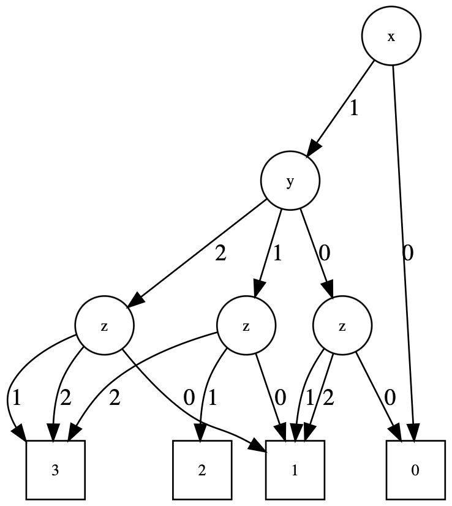

# DD

[](https://travis-ci.com/okamumu/DD.jl)
[](https://codecov.io/gh/okamumu/DD.jl)
[](https://coveralls.io/github/okamumu/DD.jl?branch=master)

DD.jl provides decision diagrams such as BDD, ZDD and MDD.

## Installation

This is not in the official package of Julia yet. Please run the following command to install it.
```
using Pkg; Pkg.add(PackageSpec(url="https://github.com/JuliaReliab/DD.jl.git"))
```

## Load module

The package consists of several submodules.

- `BDD`: A submodule for BDD (binary decision diagram).
- `ZDD`: A submodule for ZDD (zero-suppressed BDD).
- `MDD`: A submodule for MDD (multi-valued decision diagram).

If we use BDD, please load the submodule as follows.
```
using DD.BDD
```

The submodules include the functions with the same name. If we use all the types of DD, please load the module DD.
```
using DD
```
and the functions are distinguished with submodule name.

## BDD

### What is BDD?

BDD is a compact representation for boolean functions with tree structures. The boolean function is a function with boolean output defined on boolean space. Consider the following boolean function `u = f(x,y,z)`

|x|y|z|u|
|:-:|:-:|:-:|:-:|
|0|0|0|0|
|0|0|1|1|
|0|1|0|1|
|0|1|1|0|
|1|0|0|1|
|1|0|1|0|
|1|1|0|1|
|1|1|1|0|

where all the input variables and the ouput are defined by 0 or 1. The BDD representation of the above function is


From starting from the top node, we follow the edge corresponding to the given value. For example, we consider how to get the value `f(0,0,1)`. Since `z=1`, we follow the edge 1 from the node `z`. The next node indicates the variable `y`. In this case, the value `y=0` and thus we follow the edge 0. Finally, we reach the terminal node 1 (indicated by a square). The value of function `f(0,0,1)` becomes 1. The Julia code for the construction of this fuction is

```julia
using DD.BDD

b = bdd()
defvar!(b, :x, 1)
defvar!(b, :y, 2)
defvar!(b, :z, 3)
v = [[false, false, true],
     [false, true,  false],
     [true,  false, false],
     [true,  false, true],
     [true,  true,  false]]
f = genfunc!(b, v)
```

### How to use

#### Define the context and variables

Nodes in BDD are placed in the context (called `Forest`) created by `bdd()`. The variables are defined by `defvar!` in the context. The following code indicates making the context and defining three variables `x`, `y` and `z`.
```julia
b = bdd()
defvar!(b, :x, 1)
defvar!(b, :y, 2)
defvar!(b, :z, 3)
```

- `bdd(policy = FullyReduced())`: The function to create the context. The argument `policy` decides the reduction policy in BDD. The policy is either `FullyReduced()` or `QuasiReduced()`. FullyReduced omits creating the node when two edges have the same direction. The default is `FullyReduced()`
- `defvar!(b::Forest, name::Symbol, level::Int)`: Define the variable in BDD. The name should be given as a Symbol like `:x`. The level indicates the level of BDD. In the current version, the defined levels should be a consective sequence starting from 1. The lower level is more closer to the terminal node.

#### Make functions

After defining variables, we make boolean functions. The simplest function is the function from only one variable and it do not care the other variables. The function `var` makes the simplest function.
```julia
x = var!(b, :x)
```
- `var!(b::Forest, name::Symbol)`: Make the function of only the variable corresponding to the given name. If the output of this function is the same value of the variable, i.e., if the variable is 1, the output of this function is 1. Otherwise, if the variable is 0, the output is 0.

Another way to create the funciton is to use `genfunc`.
```julia
v = [[false, false, true],
     [false, true,  false],
     [true,  false, false],
     [true,  false, true],
     [true,  true,  false]]
f = genfunc!(b, v)
```
In the above example, `v` is the vector of boolean vectors that indicates the variables whose outputs are 1. For example, the first element `[false, false, true]` indicates that the output of `f(false, false, true)` is 1 where the order of variables determined by the level, i.e., `[false, false, true]` is the first level variable is false, the second level variable is false and the third level variable is true.

#### Binary operations

The two nodes in the same context can be opareted by the following boolean functions
- `and`
- `or`
- `xor`
- `imp`
- `eq`

The `z=and(x,y)` is a boolean AND operation:
|x|y|z|
|:-:|:-:|:-:|
|0|0|0|
|0|1|0|
|1|0|0|
|1|1|1|

The `z=or(x,y)` is a boolean OR operation:
|x|y|z|
|:-:|:-:|:-:|
|0|0|0|
|0|1|1|
|1|0|1|
|1|1|1|

The `z=xor(x,y)` is a boolean XOR (exclusive OR) operation:
|x|y|z|
|:-:|:-:|:-:|
|0|0|0|
|0|1|1|
|1|0|1|
|1|1|0|

The `z=imp(x,y)` is a boolean imply operation:
|x|y|z|
|:-:|:-:|:-:|
|0|0|1|
|0|1|1|
|1|0|0|
|1|1|1|

The `z=eq(x,y)` is the equivalence function:
|x|y|z|
|:-:|:-:|:-:|
|0|0|1|
|0|1|0|
|1|0|0|
|1|1|1|

All the boolean operations can be applied to nodes. Since each node represents a boolean function, `h=and(f,g)` creates a new boolean function `h` from two functions `f` and `g` whose outputs are the results of AND operation for outputs of `f` and `g`. For instance, `f(x,y,z)` and `g(x,y,z)` are

`u=f(x,y,z)`
|x|y|z|u|
|:-:|:-:|:-:|:-:|
|0|0|0|0|
|0|0|1|1|
|0|1|0|1|
|0|1|1|0|
|1|0|0|1|
|1|0|1|0|
|1|1|0|1|
|1|1|1|0|

`u=g(x,y,z)`
|x|y|z|u|
|:-:|:-:|:-:|:-:|
|0|0|0|1|
|0|0|1|0|
|0|1|0|0|
|0|1|1|0|
|1|0|0|0|
|1|0|1|1|
|1|1|0|1|
|1|1|1|0|

Then `h=and(f,g)` results in

`u=h(x,y,z)`
|x|y|z|u|
|:-:|:-:|:-:|:-:|
|0|0|0|0|
|0|0|1|0|
|0|1|0|0|
|0|1|1|0|
|1|0|0|0|
|1|0|1|0|
|1|1|0|1|
|1|1|1|0|

where the last column is the result of AND operation for the last columns of the tables `f` and `g`.

All the binary operations have the more primitive interface such as `and!(b::Forest, f, g)` where the context (Forest) is  explicitly shown.

#### Unary operation

- `not`: The function that creates a function whose outputs are inverted. `not!(b::Forest, x)` is the primitive function.

#### Ternary operation

- `ifthenelse`: The function creates a function from three functions `f`, `g` and `h`

```julia
z = ifthenelse(f, g, h)
```

If the output of f has 1, the output of z is the same as the output of g. Ohterwise, if the output of f has 0, the output of z is the same as the output of h.

#### Travere BDD

In several BDD-based algorithms, we should traverse the BDD. The package provides the following types and functions to traverse the BDD.

- Types
    - `NodeID`: Type for node id
    - `Level`: Type for node level
    - `AbstractNode`: An abstract type for a node
    - `AbstractNonTerminalNode <: AbstractNode`: An abstract type for a non-terminal node
    - `AbstractTerminalNode <: AbstractNode`: An abstract type for a terminal node
- Functions
    - `id(x)`: Get the ID of a node.
    - `level(x)`: Get a level of a node or a header.
    - `label(x)`: Get a symbol as a label of a node or a header.
    - `get_zero(x::AbstractNonTerminalNode)`: Get a node by following the 0-edge of a given node.
    - `get_one(x::AbstractNonTerminalNode)`: Get a node by following the 1-edge of a given node.
    - `iszero(x::AbstractNode)`: Return a boolean value if x is the 0-terminal node. If x is a non-terminal node, the function always returns false.
    - `isone(x::AbstractNode)`: Return a boolean value if x is the 1-terminal node. If x is a non-terminal node, the function always returns false.

For example, we present the code to convert a sparse matrix:
```julia
function tomat(x::AbstractNode)
    visited = Set{NodeID}([])
    results = Tuple{Int,Int}[]
    _tomat(x, visited, results)
    results
end

function _tomat(x::AbstractNonTerminalNode, visited, results)
    if !in(id(x), visited)
        b0 = get_zero(x)
        push!(results, (id(x), id(b0)))
        _tomat(b0, visited, results)
        b1 = get_one(x)
        push!(results, (id(x), id(b1)))
        _tomat(get_one(x), visited, results)
        push!(visited, id(x))
    end
end

function _tomat(x::AbstractTerminalNode, visited, results)
    if !in(id(x), visited)
        push!(visited, id(x))
    end
end
```

#### Make funcitons by manuplating BDD tree.

The function (BDD tree) can be created by using the function `node!`.

- `node!(b::Forest, x::Symbol, low, high)`: Make a non-terminal node of the variable whose Symbol is the argument `x` by connecting two nodes `low` (0-edge) and `high` (1-edge) as children.

Note that this function do not care the level of variables. The levels of low and high nodes should be lower than the level of the node with symbol `x`. The information on the variables in BDD can be obtained by the function `vars(b::Forest)`. The returned value is the dictionary whose key and value are Symbol and NodeHeader. The name and level can be obtained by `label` and `level` functions of NodeHeader.

```julia
# creating the dictionaly Variable-name => Level
h = Dict([k => level(v) for (k,v) = vars(b)])
```

## ZDD

not yet

## MDD

### What is MDD?

MDD is a compact representation for integer functions with tree structures. The integer function is a function with integer output defined on integer space. Consider the following integer function $u = f(x,y,z)$, $x \in [0,1]$, $y \in [0,1,2]$, $z \in [0,1,2]$, $u \in [0,1,2,3]$.

|x|y|z|u|
|:-:|:-:|:-:|:-:|
|0|0|0|0|
|0|0|1|0|
|0|0|2|0|
|0|1|0|0|
|0|1|1|0|
|0|1|2|0|
|0|2|0|0|
|0|2|1|0|
|0|2|2|0|
|1|0|0|0|
|1|0|1|1|
|1|0|2|1|
|1|1|0|1|
|1|1|1|2|
|1|1|2|3|
|1|2|0|1|
|1|2|1|3|
|1|2|2|3|

The MDD representation of the above function is



From starting from the top node, we follow the edge corresponding to the given value. For example, we consider how to get the value `f(1,2,0)`. Since `x=1`, we follow the edge 1 from the node `x`. The next node indicates the variable `y`. In this case, the value `y=2` and thus we follow the edge 2. Similary, we follow the edge 0 from the node `z`. Finally, we reach the terminal node 1 (indicated by a square). The value of function `f(1,2,0)` becomes 1. An example of the Julia code for the construction of this fuction is

```julia
using DD.MDD

b = mdd()
defvar!(b, :x, 3, [0,1])
defvar!(b, :y, 2, [0,1,2])
defvar!(b, :z, 1, [0,1,2])
v = [
    [0, 0, 0, 0],
    [1, 0, 0, 0],
    [2, 0, 0, 0],
    [0, 1, 0, 0],
    [1, 1, 0, 0],
    [2, 1, 0, 0],
    [0, 2, 0, 0],
    [1, 2, 0, 0],
    [2, 2, 0, 0],
    [0, 0, 1, 0],
    [1, 0, 1, 1],
    [2, 0, 1, 1],
    [0, 1, 1, 1],
    [1, 1, 1, 2],
    [2, 1, 1, 3],
    [0, 2, 1, 1],
    [1, 2, 1, 3],
    [2, 2, 1, 3]
]
f = genfunc!(b, v)
```

```julia
using DD.MDD

b = mdd()
defvar!(b, :x, 3, [0,1])
defvar!(b, :y, 2, [0,1,2])
defvar!(b, :z, 1, [0,1,2])
x = var!(b, :x)
y = var!(b, :y)
z = var!(b, :z)
f = @match(
    x == 0 => 0,
    y == 0 && z == 0 => 0,
    y == 0 || z == 0 => 1,
    y == 2 || z == 2 => 3,
    _ => 2)
```

### How to use

#### Define the context and variables

Nodes in MDD are placed in the context (called `Forest`) created by `mdd()`. The variables are defined by `defvar!` in the context. The following code indicates making the context and defining three variables `x`, `y` and `z`.
```julia
b = mdd()
defvar!(b, :x, 1, 0:1)
defvar!(b, :y, 2, 0:2)
defvar!(b, :z, 3, [0,1,2])
```

- `mdd(policy = FullyReduced())`: The function to create the context. The argument `policy` decides the reduction policy in MDD. The policy is either `FullyReduced()` or `QuasiReduced()`. FullyReduced omits creating the node when two edges have the same direction. In this version, QuasiReduced policy has not implemented yet.
- `defvar!(b::Forest, name::Symbol, level::Int, domain::AbstractVector)`: Define the variable in MDD. The name should be given as a Symbol like `:x`. The level indicates the level of MDD. In the current version, the defined levels should be a consective sequence starting from 1. The lower level is more closer to the terminal node. The `domain` indicates the domain of the variable which is given by AbstractVector such as `[0,1,2]` and `0:2`.

#### Make functions

After defining variables, we make boolean functions. The simplest function is the function from only one variable and it do not care the other variables. The function `var` makes the simplest function.
```julia
x = var!(b, :x)
```
- `var!(b::Forest, name::Symbol)`: Make the function of only the variable corresponding to the given name. If the output of this function is the same value of the variable, i.e., `f = var!(b, :x)` is equal to the function $f(x) = x$.

Another way to create the funciton is to use `genfunc`.
```julia
v = [
    [0, 0, 0, 0],
    [1, 0, 0, 0],
    [2, 0, 0, 0],
    [0, 1, 0, 0],
    [1, 1, 0, 0],
    [2, 1, 0, 0],
    [0, 2, 0, 0],
    [1, 2, 0, 0],
    [2, 2, 0, 0],
    [0, 0, 1, 0],
    [1, 0, 1, 1],
    [2, 0, 1, 1],
    [0, 1, 1, 1],
    [1, 1, 1, 2],
    [2, 1, 1, 3],
    [0, 2, 1, 1],
    [1, 2, 1, 3],
    [2, 2, 1, 3]
]
f = genfunc!(b, v)
```
In the above example, `v` is the vector of integer vectors that indicates a pair of the input variables and the output value. For example, the last element `[2, 2, 1, 3]` indicates that the function takes `f(2, 2, 1) = 3` where the order of variables determined by the level, i.e., the first three elements `[2, 2, 1]` corresponds to the inputs as the first level variable is 2, the second level variable is 2 and the third level variable is 1.

#### Arithmetic operations

This package provides the arithmetic operations `+`, `-`, `*`, `max`, `min`. Therefore, if we want to define the function $f(x,y,z) = 3 x + y -2 z$, we can write
```julia
using DD.MDD

b = mdd()
defvar!(b, :x, 3, [0,1])
defvar!(b, :y, 2, [0,1,2])
defvar!(b, :z, 1, [0,1,2])
x = var!(b, :x)
y = var!(b, :y)
z = var!(b, :z)
f = 3*x + y - 2*z
```

#### Comparison operations

This package provides the comparison operations `==`, `!=`, `<`, `<=`, `>`, `>=`. These operations return a boolean value; true or false (node) in MDD which is used in the operation `ifthenelse`.

As an example, the result of $3 x + y - 2 z >= 0$  can be written
```julia
using DD.MDD

b = mdd()
defvar!(b, :x, 3, [0,1])
defvar!(b, :y, 2, [0,1,2])
defvar!(b, :z, 1, [0,1,2])
x = var!(b, :x)
y = var!(b, :y)
z = var!(b, :z)
f = 3*x + y - 2*z
result = f >= 0
```

#### Logical operations

This package also provides logical operations `!` (not), `and` and `or` for the MDD trees whose terminal nodes are true or false.
As an example, the result of $0 <= 3 x + y - 2 z < 2$  can be written
```julia
using DD.MDD

b = mdd()
defvar!(b, :x, 3, [0,1])
defvar!(b, :y, 2, [0,1,2])
defvar!(b, :z, 1, [0,1,2])
x = var!(b, :x)
y = var!(b, :y)
z = var!(b, :z)
f = 3*x + y - 2*z
result = !and(f >= 0, f < 2)
```

#### If-Then-Else operation

The function `ifthenelse(f,g,h)` makes a function from three functions `f`, `g` and `h`.
As an example, we make the function
$$
g(x,y,z) = 5 ~~~~~\text{if}~~ 0 <= 3 x + y - 2 z < 2,
$$
$$
g(x,y,z) = 10 ~~~~~\text{oterwise}~$$
```julia
using DD.MDD

b = mdd()
defvar!(b, :x, 3, [0,1])
defvar!(b, :y, 2, [0,1,2])
defvar!(b, :z, 1, [0,1,2])
x = var!(b, :x)
y = var!(b, :y)
z = var!(b, :z)
f = 3*x + y - 2*z
result = and(f >= 0, f < 2)
g = ifthenelse(result, 5, 10)
```

Also the macro `@match` is a convenient way to create the function. `@match` is similar to the match sentence like Rust.

```julia
using DD.MDD

b = mdd()
defvar!(b, :x, 3, [0,1])
defvar!(b, :y, 2, [0,1,2])
defvar!(b, :z, 1, [0,1,2])
x = var!(b, :x)
y = var!(b, :y)
z = var!(b, :z)
f = @match(
    x == 0 => 0,
    y == 0 && z == 0 => 0,
    y == 0 || z == 0 => 1,
    y == 2 || z == 2 => 3,
    _ => 2)
```

In the above example, the conditions are applied sequencially from `x==0` to `y==2`. If the variable matches the condition, the function takes the value placed on the righthand side of `=>`. The last statement indicates OTHERWISE which is represented by `_`.

#### Travere MDD

In several MDD-based algorithms, we should traverse the MDD. The package provides the following types and functions to traverse the MDD.

- Types
    - `NodeID`: Type for node id
    - `Level`: Type for node level
    - `DomainValue`: Type for value (Int)
    - `AbstractNode`: An abstract type for a node
    - `AbstractNonTerminalNode <: AbstractNode`: An abstract type for a non-terminal node
    - `AbstractTerminalNode{T} <: AbstractNode`: An abstract type for a terminal node. T (DomainValue or Bool) is a type of value. When T is Nothing, the terminal node indicates the corresponding value is undefined.
- Functions
    - `id(x)`: Get the ID of a node.
    - `level(x)`: Get a level of a node or a header.
    - `label(x)`: Get a symbol as a label of a node or a header.
    - `domain(x)`: Get a domain of a node or a header.
    - `get_nodes(x::AbstractNonTerminalNode)`: Get a vector of nodes as children.
    - `isfalse(x::AbstractNode)`: Return a boolean value if x is the false-terminal node. If x is a non-terminal node, the function always returns false.
    - `istrue(x::AbstractNode)`: Return a boolean value if x is the true-terminal node. If x is a non-terminal node, the function always returns false.
    - `isnothing(x::AbstractNode)`: Return a boolean value if x is the nothing-terminal node, which indicates the corresponding value is not defined. If x is a non-terminal node, the function always returns false.

For example, we present the code to convert a sparse matrix:
```julia
function tomat(x::AbstractNode)
    visited = Set{NodeID}([])
    results = Tuple{Int,Int}[]
    _tomat(x, visited, results)
    results
end

function _tomat(x::AbstractNonTerminalNode, visited, results)
    if !in(id(x), visited)
        nodes = get_nodes(x)
        for y = nodes
            push!(results, (id(x), id(y)))
            _tomat(y, visited, results)
        end
        push!(visited, id(x))
    end
end

function _tomat(x::AbstractTerminalNode, visited, results)
    if !in(id(x), visited)
        push!(visited, id(x))
    end
end
```

#### Make funcitons by manuplating MDD tree.

The function (MDD tree) can be created by using the function `node!` and `value!`.

- `node!(b::Forest, x::Symbol, nodes::Vector{AbstractNode})`: Make a non-terminal node of the variable whose Symbol is the argument `x` by connecting `nodes` as children.
- `value!(b::Forest, x)`: Make a n terminal node for a given value `x`.

Note that this function do not care the level of variables. The levels of low and high nodes should be lower than the level of the node with symbol `x`. The information on the variables in BDD can be obtained by the function `vars(b::Forest)`. The returned value is the dictionary whose key and value are Symbol and NodeHeader. The name and level can be obtained by `label` and `level` functions of NodeHeader.

```julia
# creating the dictionaly Variable-name => Level
h = Dict([k => level(v) for (k,v) = vars(b)])
```
