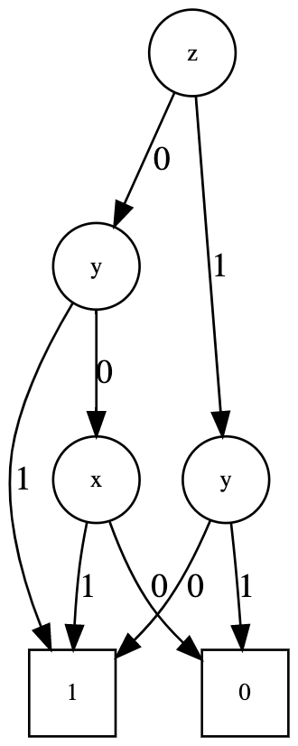

# DD

[](https://travis-ci.com/okamumu/DD.jl)
[](https://codecov.io/gh/okamumu/DD.jl)
[](https://coveralls.io/github/okamumu/DD.jl?branch=master)

DD.jl provides decision diagrams such as BDD, ZDD and MDD.

## Installation

This is not in the official package of Julia yet. Please run the following command to install it.
```
using Pkg; Pkg.add(PackageSpec(url="https://github.com/JuliaReliab/DD.jl.git"))
```

## Load module

The package consists of several submodules.

- `BDD`: A submodule for BDD (binary decision diagram).
- `ZDD`: A submodule for ZDD (zero-suppressed BDD).
- `MDD`: A submodule for MDD (multi-valued decision diagram).

If we use BDD, please load the submodule as follows.
```
using DD.BDD
```

The submodules include the functions with the same name. If we use all the types of DD, please load the module DD.
```
using DD
```
and the functions are distinguished with submodule name.

## What is DD

### BDD

BDD is a compact representation for boolean functions with tree structures. The boolean function is a function with boolean output defined on boolean space. Consider the following boolean function `u = f(x,y,z)`

|x|y|z|u|
|:-:|:-:|:-:|:-:|
|0|0|0|0|
|0|0|1|1|
|0|1|0|1|
|0|1|1|0|
|1|0|0|1|
|1|0|1|0|
|1|1|0|1|
|1|1|1|0|

where all the input variables and the ouput are defined by 0 or 1. The BDD representation of the above function is



From starting from the top node, we follow the edge corresponding to the given value. For example, we consider how to get the value `f(0,0,1)`. Since `z=1`, we follow the edge 1 from the node `z`. The next node indicates the variable `y`. In this case, the value `y=0` and thus we follow the edge 0. Finally, we reach the terminal node 1 (indicated by a square). The value of function `f(0,0,1)` becomes 1. The Julia code for the construction of this fuction is

```julia
b = bdd()
addvar!(b, :x, 1)
addvar!(b, :y, 2)
addvar!(b, :z, 3)
v = [[false, false, true],
     [false, true,  false],
     [true,  false, false],
     [true,  false, true],
     [true,  true,  false]]
f = addfunc!(b, v)
```

## How to use

